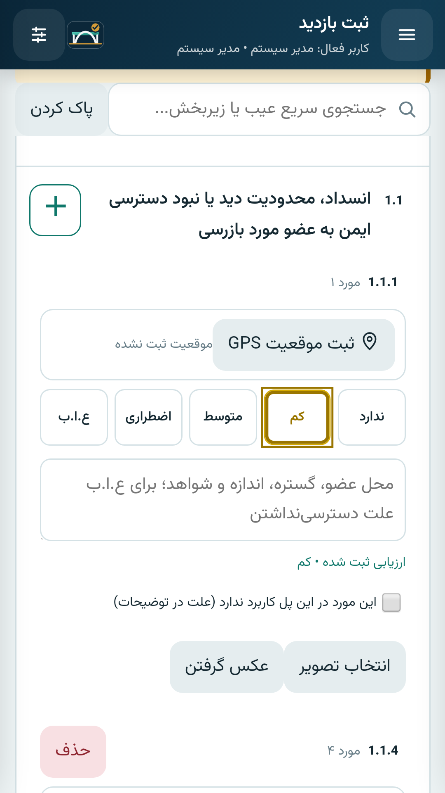
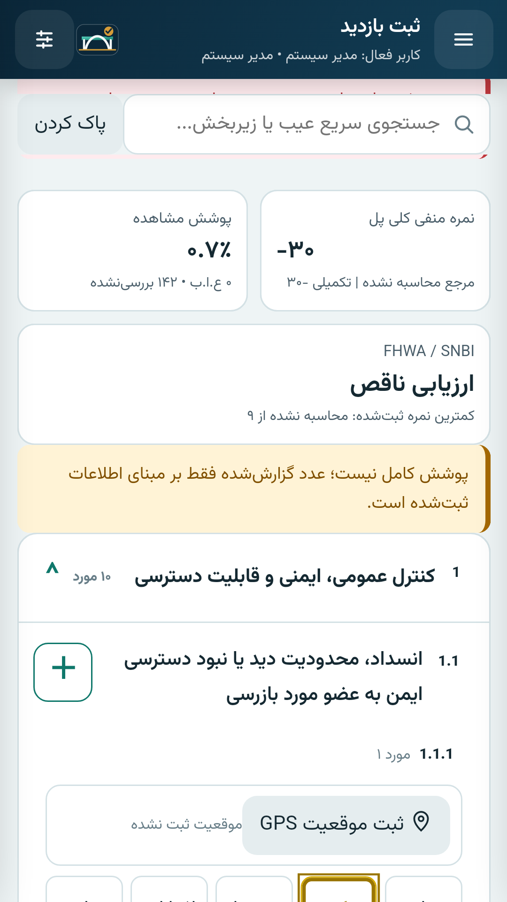
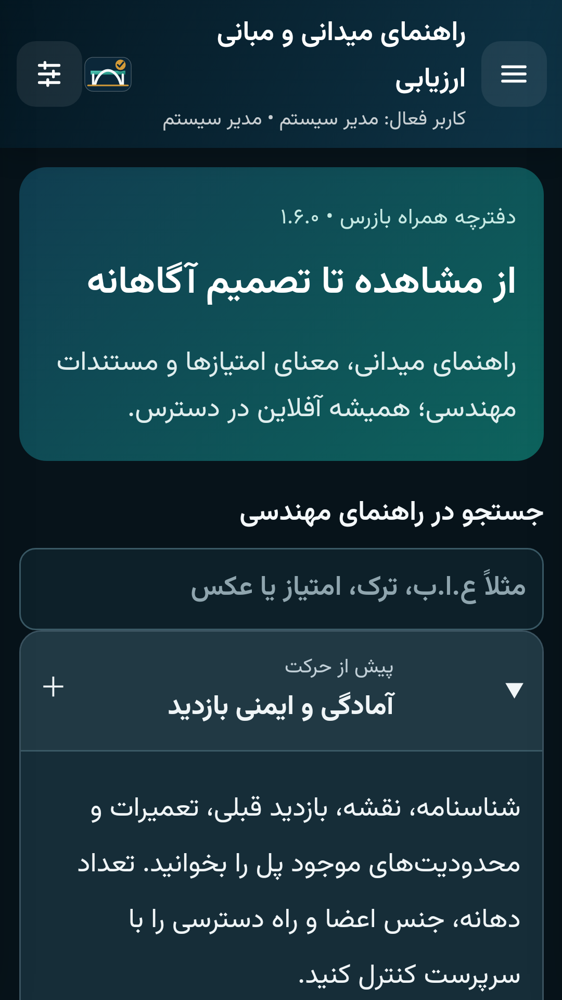

# بازرسی پل — Bridge Maintenance 1.6.0

برنامه آفلاین فارسی برای شناسنامه پل، بازرسی چشمی، مستندسازی آسیب، پیگیری تعمیر و گزارش‌گیری. شناسه برنامه `ir.bridge.maintenance`، کد نسخه `10600` و حداقل اندروید ۸ (`API 26`) است.

## دریافت و نصب

[دانلود آخرین نسخهٔ منتشرشده](https://github.com/daniyalsalimidsds/DS-Bridge-Maintenance/releases/latest) · [Release نسخهٔ v1.6.0](https://github.com/daniyalsalimidsds/DS-Bridge-Maintenance/releases/tag/v1.6.0)

| فایل | کاربرد |
|---|---|
| [APK امضاشده](https://github.com/daniyalsalimidsds/DS-Bridge-Maintenance/releases/download/v1.6.0/Bridge_Maintenance_v1.6.0.apk) | نصب یا ارتقای مستقیم روی گوشی |
| [بستهٔ کامل نصب](https://github.com/daniyalsalimidsds/DS-Bridge-Maintenance/releases/download/v1.6.0/Bridge_Maintenance_v1.6.0_INSTALL.zip) | APK، راهنمای فارسی، نمونه PDF/Excel/CSV و تصاویر آزمون |
| [سورس کامل نسخه](https://github.com/daniyalsalimidsds/DS-Bridge-Maintenance/releases/download/v1.6.0/Bridge_Maintenance_v1.6.0_Source.zip) | سورس، Gradle Wrapper، آزمون‌ها، داده مرجع و مستندات |
| [SHA256SUMS](https://github.com/daniyalsalimidsds/DS-Bridge-Maintenance/releases/download/v1.6.0/SHA256SUMS.txt) | کنترل صحت فایل‌های دریافت‌شده |

نسخهٔ امضاشده و بستهٔ نصب در [پوشهٔ انتشار مخزن](releases/v1.6.0/) نیز نگهداری می‌شوند. پیش از ارتقا، از داخل برنامه **پشتیبان کامل ZIP** بگیرید؛ نسخهٔ قبلی را حذف نکنید. Android 8 یا بالاتر و WebView سازگار لازم است. [راهنمای ارتقا](releases/v1.6.0/README.md) مراحل و کنترل پس از نصب را توضیح می‌دهد.

مخزن در حال حاضر خصوصی است؛ دسترسی به فایل‌های Release نیز به حساب مجاز GitHub نیاز دارد.

## نمای برنامه

تصاویر زیر از اجرای واقعی روی شبیه‌ساز و با دادهٔ آزمایشی ثبت شده‌اند.

<p>
  
  
  
</p>

## تغییرات اصلی ۱.۶.۰

- پنج وضعیت «ندارد، کم، متوسط، اضطراری، ع.ا.ب» با تأیید صریح بررسی؛ گزینه انتخاب‌نشده سالم محسوب نمی‌شود.
- تطبیق ۷۹ ردیف دارای آسیب در `VELAYAT.xlsx`: افزودن ۳۲ مورد، تطبیق دقیق نام ۱۴ معادل مستقل و حفظ همه شناسه‌ها و آسیب‌های تفکیک‌شده قبلی. کاتالوگ پایه اکنون ۴۹۷ مورد در ۴۱ گروه دارد؛ فهرست قابل اعمال هر پل از شناسنامه تولید می‌شود.
- نمره منفی وزنی و ثبت نسخه روش هنگام امضا؛ سهم مرجع و تکمیلی جداست و یک ردیف مرجع به علت چند رخداد یا گزینه تفکیک‌شده چندبار شمرده نمی‌شود.
- ارزیابی مستقل اجزای `B.C.01–B.C.11` با چارچوب FHWA/SNBI، جمع‌بندی خوب/متوسط/ضعیف و ارزیابی مقداری چهار حالت `CS1–CS4`.
- راهنمای میدانی جستجوپذیر برای بازرس تازه‌کار و بازبین؛ مبانی محاسبه، دسترسی، شواهد، خطر فوری، عکس و پیگیری در خود برنامه و به فارسی در دسترس است.
- رابط خواناتر با فونت وزیرمتن، کنترل‌های لمس بزرگ، عنوان‌های چندخطی، رنگ وضعیت، حالت شب و اندازه متن قابل تنظیم.
- رفع جابه‌جایی ارتباط عکس/GPS پس از حذف رخداد، جلوگیری از بازگشت GPS پاک‌شده و رد پاسخ رسانه مربوط به بازدید یا رخداد حذف‌شده.
- جدول‌های RTL در PDF و Excel با اندازه متناسب متن و ادامه متن بسیار بلند؛ حذف ستون خالی و جمع‌بندی هر بازدید در انتهای جدول. CSV متن/عدد کامل دارد؛ این قالب ابعاد یا رنگ سلول ذخیره نمی‌کند.

## مبنای مهندسی

در فایل ارسالی، امتیاز پایه به‌ترتیب `۰، −۱۰، −۳۰، −۱۰۰، −۱۰` است؛ مقدار آخر برای ع.ا.ب است. ضریب اهمیت ۱ تا ۵ در امتیاز پایه ضرب می‌شود. نمونه فایل دقیقاً به **−۲۴۰** می‌رسد.

ع.ا.ب به معنی عدم امکان بازرسی است؛ سالم یا شدت آسیب واقعی نیست. امتیاز شهرداری به نمره FHWA تبدیل نمی‌شود. نمره FHWA به شواهد جزء و نام ارزیاب نیاز دارد؛ چارچوب آمریکایی راه‌هاست و در ایران یا پل ریلی کاربرد مقایسه‌ای دارد. ضرایب موارد خارج از اکسل پیشنهاد این نسخه‌اند و برای کاربرد رسمی باید در روش سازمان پذیرفته شوند.

- [روش محاسبه و مثال‌ها](docs/SCORING_METHODS.md)
- [ممیزی تطبیق فهرست و ضرایب](docs/CATALOG_AUDIT.md)
- [مراجع رسمی و ایده‌های طراحی](docs/ENGINEERING_REFERENCES.md)
- [تغییرات نسخه‌ها](docs/CHANGELOG.md)، [مدل داده](docs/DATA_DICTIONARY.md)، [محدودیت‌های عملی](docs/KNOWN_LIMITATIONS.md)

## ساخت و آزمون

```bash
node --test tests/js/*.test.js
python3 tools/check_bridge_source.py
./gradlew testDebugUnitTest lintRelease assembleDebug assembleDebugAndroidTest assembleRelease
bash tools/run_direct_instrumentation.sh
```

دستور آخر به دستگاه یا شبیه‌ساز اندروید نیاز دارد. workflow **Bridge Maintenance Build and QA** آزمون‌های کد، ساخت release و آزمون‌های شبیه‌ساز را اجرا می‌کند؛ تصاویر آزمون رابط و نمونه خروجی فارسی در artifact آزمون اندروید قرار می‌گیرند. نتیجه هر commit باید از همان اجرای CI بررسی شود.

کلید امضا و رمزها در مخزن نیستند. نصب به‌صورت به‌روزرسانی نسخه ۱.۵.۰ به همان گواهی امضای قبلی نیاز دارد. روش ساخت و امضا در [راهنمای تحویل](docs/BUILD_AND_RELEASE.md) آمده است.

## وضعیت اعتبارسنجی نسخهٔ تحویلی

| کنترل | نتیجهٔ ثبت‌شده |
|---|---|
| آزمون‌های JavaScript | ۲۳ ورودی آزمون موفق |
| آزمون‌های واحد Java | ۶ آزمون موفق |
| آزمون‌های اندروید | ۲۵ آزمون موفق روی Android 11 / API 30، Pixel 2 |
| ساخت release و هویت بسته | موفق؛ نسخه ۱.۶.۰ و کد ۱۰۶۰۰ |
| Android Lint | بدون Error/Fatal؛ ۳۸ Warning در گزارش موجود است |
| امضای APK | v2 و v3 معتبر؛ همان گواهی نسخهٔ ۱.۵.۰ ارسالی |

[اجرای آزمون نسخهٔ تحویلی](https://github.com/daniyalsalimidsds/DS-Bridge-Maintenance/actions/runs/34063041622) · [شناسنامهٔ کنترل](releases/v1.6.0/RELEASE_VERIFICATION.json) · [گزارش پذیرش](docs/RELEASE_QA.md) · [اجراهای خودکار مخزن](https://github.com/daniyalsalimidsds/DS-Bridge-Maintenance/actions)

APK تحویلی از کد `080656b25b5efa971541d966acc792693f4ee187` ساخته شده است. تغییرهای تکمیل مخزن مربوط به مستندات و انتشارند؛ فهرست SHA-256 فایل‌های برنامه، تطابق آن‌ها با همین نسخه را هنگام انتشار کنترل می‌کند. آزمون گوشی واقعی، GPS و دوربین میدانی هنوز انجام نشده است.

## ساختار مخزن

| مسیر | محتوا |
|---|---|
| `app/src/main/java/` | کد بومی Android، SQLite، رسانه، موقعیت و گزارش |
| `app/src/main/assets/` | رابط فارسی، چک‌لیست، محاسبات، فونت و راهنمای میدانی |
| `app/src/androidTest/` و `app/src/test/` | آزمون‌های اندروید و Java |
| `tests/` | آزمون‌های JavaScript و داده‌های سازگاری نسخه‌های قبلی |
| `reference/` | شناسنامه مرجع، کاتالوگ استخراج‌شده و ممیزی ضرایب |
| `docs/` | معماری، مبانی علمی، ساخت، امنیت، تغییرات و تصاویر برنامه |
| `tools/` | تولید داده، کنترل سورس، آزمون دستگاه و انتشار نسخه |
| `releases/v1.6.0/` | فایل‌های امضاشده، راهنمای نصب، نتایج کنترل و یادداشت انتشار |
| `.github/workflows/` | ساخت و آزمون Android و انتشار فایل‌های تأییدشده |

## توسعه و حقوق اجزای همراه

[راهنمای مشارکت](CONTRIBUTING.md) · [امنیت و گزارش مشکل](SECURITY.md) · [مجوز وابستگی‌ها](docs/DEPENDENCY_LICENSES.md) · [منشأ و مجوز دارایی‌ها](docs/THIRD_PARTY_ASSETS.md)

توسعه‌دهنده: **دانیال سلیمی — Daniyal Salimi**. مجوز متن‌باز مستقلی برای کل برنامه تعیین نشده است؛ مجوز فونت‌ها و کتابخانه‌های همراه در فایل‌های مربوط به همان اجزا ثبت شده‌اند.
